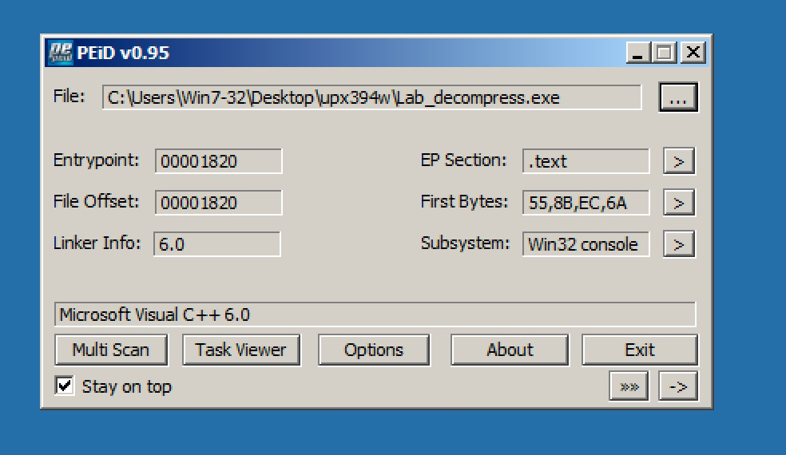
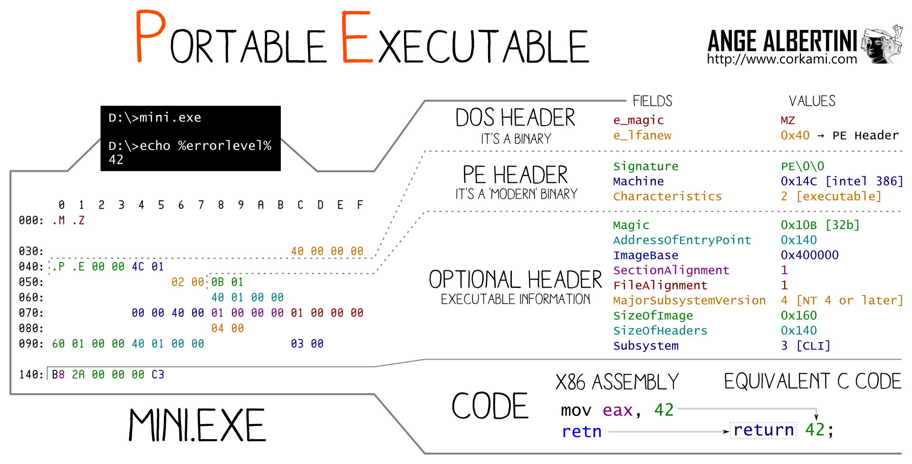
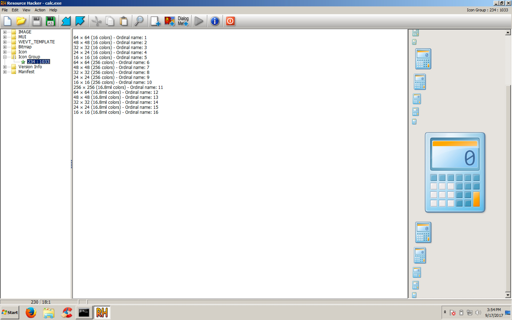
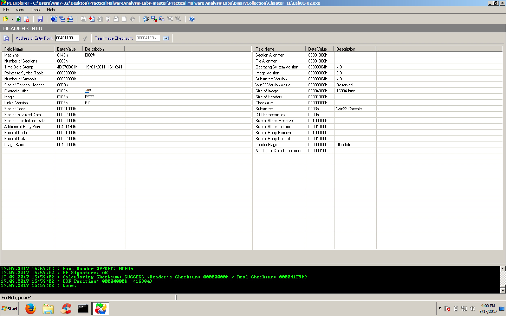

#### 1. Basic Static Techniques

- Antivirus Scanning - uses heuristics and file signatures
	- [VirusTotal](https://www.virustotal.com)
	
- Hashing

	```sh
	C:\Users\Win7-32>md5deep.exe key_checker.exe
	61acb0bb5ff94d62c215096585a06c66 key_checker.exe
	C:\Users\Win7-32>
	```
- Strings

	```sh
	C:\Users\Win7-32>strings.exe key_checker.exe
	```
	
	- Unicode ~ Microsoft's Wide Character
	- ASCII strings = 1 byte per character &rarr; ```A```
	- Unicode string = 2 bytes per character &rarr; ```W```

	
	
	
	
- Packed and Obfuscated Malware
	- Packed and obfuscated code will often include at least the functions `LoadLibrary` and `GetProcAddress`, which are used to load and gain access to additional functions.


```sh
C:\Users\Win7-32\Desktop\upx394w>upx.exe
                       Ultimate Packer for eXecutables
                          Copyright (C) 1996 - 2017
UPX 3.94w       Markus Oberhumer, Laszlo Molnar & John Reiser   May 12th 2017

Usage: upx [-123456789dlthVL] [-qvfk] [-o file] file..

Commands:
  -1     compress faster                   -9    compress better
  -d     decompress                        -l    list compressed file
  -t     test compressed file              -V    display version number
  -h     give more help                    -L    display software license
Options:
  -q     be quiet                          -v    be verbose
  -oFILE write output to 'FILE'
  -f     force compression of suspicious files
  -k     keep backup files
file..   executables to (de)compress

Type 'upx --help' for more detailed help.

UPX comes with ABSOLUTELY NO WARRANTY; for details visit https://upx.github.io

C:\Users\Win7-32\Desktop\upx394w>
```

```sh
C:\Users\Win7-32\Desktop\upx394w>upx.exe -1 Lab01-01.exe -o Lab_compress.exe
                       Ultimate Packer for eXecutables
                          Copyright (C) 1996 - 2017
UPX 3.94w       Markus Oberhumer, Laszlo Molnar & John Reiser   May 12th 2017

        File size         Ratio      Format      Name
   --------------------   ------   -----------   -----------
     16384 ->      4608   28.13%    win32/pe     Lab_compress.exe

Packed 1 file.

C:\Users\Win7-32\Desktop\upx394w
```


```sh
C:\Users\Win7-32\Desktop\upx394w>upx.exe -d Lab_compress.exe -o Lab_decompress.exe
                       Ultimate Packer for eXecutables
                          Copyright (C) 1996 - 2017
UPX 3.94w       Markus Oberhumer, Laszlo Molnar & John Reiser   May 12th 2017

        File size         Ratio      Format      Name
   --------------------   ------   -----------   -----------
     16384 <-      4608   28.13%    win32/pe     Lab_decompress.exe

Unpacked 1 file.

C:\Users\Win7-32\Desktop\upx394w>
```



###### PE File Format

- Windows executables
- object code
- DLLs

Field | Information revealed
------|------------------------
Imports | Functions from other libraries that are used by the malware
Exports | Functions in the malware that are meant to be called by other programs or libraries
Time Date Stamp | Time when the program was compiled
Sections | Names of sections in the file and their sizes on disk and in memory
Subsystem | Indicates whether the program is a command-line or GUI application 
Resources | Strings, icons, menus, and other information included in the file



- ```Imports``` are functions used by one program that are actually stored in a different program, such as code libraries that contain functionality common to many programs. 

- Code libraries can be connected to the main executable by ```linking```.
	- ```Static Linking```
		- When a library is statically linked to an executable, all code from that library is copied into the executable, which makes the executable grow in size.
	- ```Runtime Linking```
		- Executables that use runtime linking connect to libraries only when that function is needed, not at program start
		- ```LoadLibrary```, ```GetProcAddress```, ```LdrGetProcAddress```, ```LdrLoadDll``` allow a program to access any function in any library on the system
	- ```Dynamic Linking```
		- When libraries are dynamically linked, the host OS searches for the necessary libraries when the program is loaded. When the program calls the linked library function, that function executes within the library.
		- View dynamically linked libraries
		
		

			DLL | Description
			----|-------------
			Kernel32.dll | This is a very common DLL that contains core functionality, such as access and manipulation of memory, files, and hardware.
			Advapi32.dll | This DLL provides access to advanced core Windows components such as the Service Manager and Registry.
			User32.dll | This DLL contains all the user-interface components, such as buttons, scroll bars, and components for controlling and responding to user actions.
			Gdi32.dll | This DLL contains functions for displaying and manipulating graphics.
			Ntdll.dll | This DLL is the interface to the Windows kernel. Executables generally do not import this file directly, although it is always imported indirectly by Kernel32.dll. If an executable imports this file, it means that the author intended to use functionality not normally available to Windows programs. Some tasks, such as hiding functionality or manipulating processes, will use this interface.
			WSock32.dll and Ws2_32.dll | These are networking DLLs. A program that accesses either of these most likely connects to a network or performs network-related tasks.
			Wininet.dll | This DLL contains higher-level networking functions that implement protocols such as FTP, HTTP, and NTP.

	- Appendix A &rarr; Important Windows Functions
	
	- Sections in PE

		Executable | Description
		-----------|------------------
		.text | Contains the executable code
		.rdata | Holds read-only data that is globally accessible within the program
		.data | Stores global data accessed throughout the program
		.idata | Sometimes present and stores the import function information; if this section is not present, the import function information is stored in the .rdata section
		.edata | Sometimes present and stores the export function information; if this section is not present, the export function information is stored in the .rdata section
		.pdata | Present only in 64-bit executables and stores exception-handling information .rsrc Stores resources needed by the executable
		.reloc | Contains information for relocation of library files
		
		
		
	- Viewing the Resource Section
		- Malware, and occasionally legitimate software, often store an embedded program or driver in the resource section. When the program runs, they extract the embedded executable or driver. Resource Hacker lets you extract these files for individual analysis.
		
		
		
	- Other PE Tools

	
	
