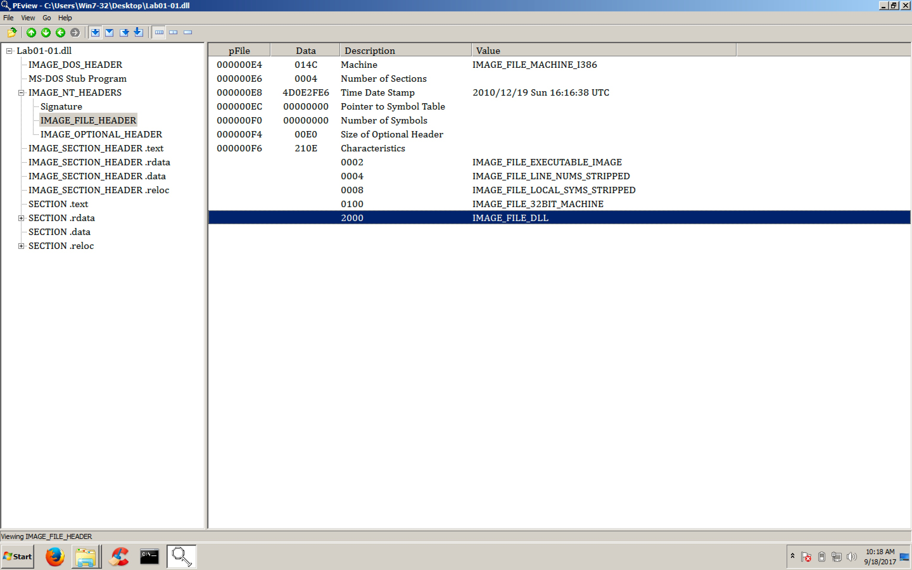
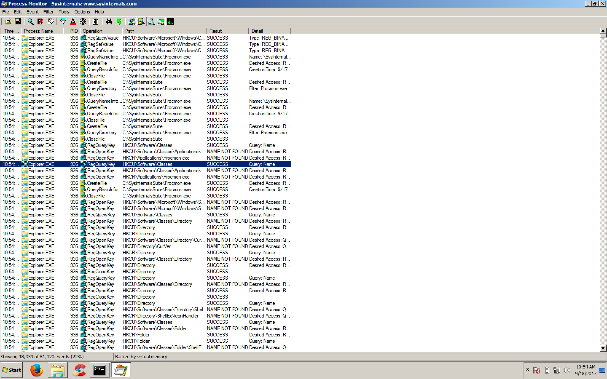
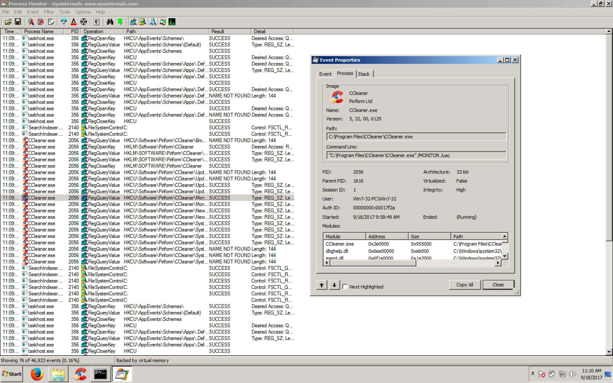
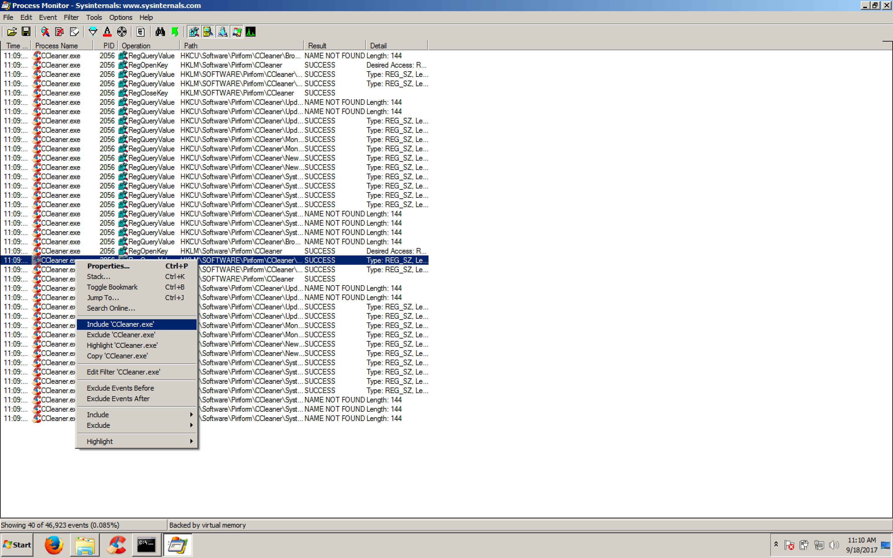
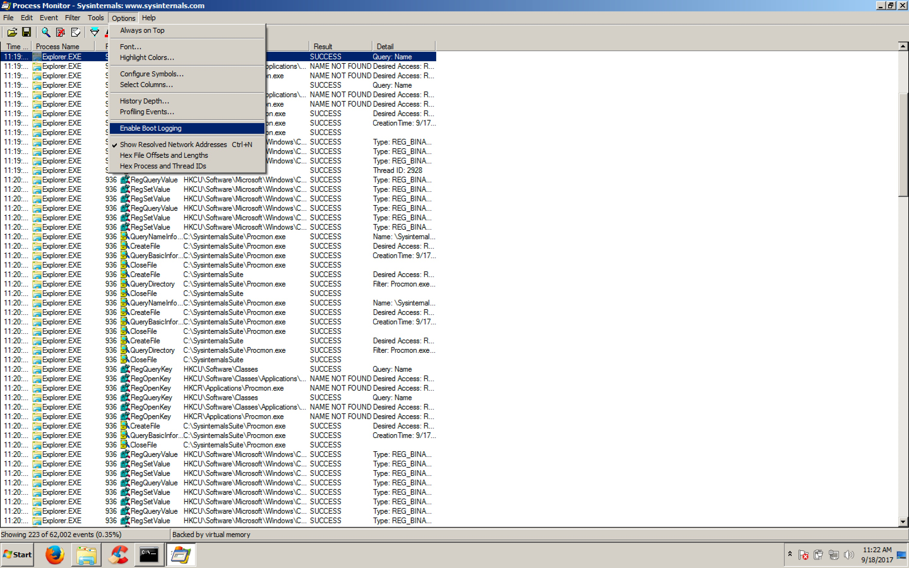

#### 3. Basic Dynamic Analysis

###### Sandboxes

- Norman SandBox
- GFI Sandbox
- Anubis
- Joe Sandbox
- ThreatExpert
- BitBlaze
- Comodo Instant Malware Analysis

Usual analysis leads to 

- Analysis Summary
- File Activity
- Created Mutexes
- Registry Activity
- Network Activity
- VirusTotal Results

###### Running Malware

- Run DLL

```sh
C:\>rundll32.exe DLLname, Export arguments
```

View exports of a DLL - PEview, PE Explorer 

```sh
C:\>rundll32.exe rip.dll, Install
```

Where ```Install``` is one of the exports

```sh
C:\>rundll32.exe xyzzy.dll, #5
```

where ```5``` is the ordinal number that you want to call, prepended with the # character

- Convert a ```DLL``` into an ```EXE```

Remove the ```IMAGE_FILE_DLL``` (```0x2000```) flag from the Characteristics field in the ```IMAGE_FILE_HEADER```

This will cause the ```DLLMain``` method to run.




- Install DLL malware as a service

DLL malware may also need to be installed as a service

```sh
C:\>rundll32.exe ipr32x.dll,InstallService ServiceName 
C:\>net start ServiceName
```

Where ```InstallService``` is an export. The ```ServiceName``` argument must be provided to the malware so it can be installed and run. The ```net start``` command is used to start a service on a Windows system. 

**When you see a ```ServiceMain``` function without a convenient exported function such as ```Install``` or ```InstallService```, you may need to install the service manually. You can do this by using the Windows ``sc`` command or by modifying the registry for an unused service, and then using ```net start``` on that service. The service entries are located in the registry at ```HKLM\SYSTEM\CurrentControlSet\Services```.**

###### Monitoring with Process Monitor

- Does not capture

	- Device driver activity of a user-mode component talking to a rootkit via device I/O controls
	- GUI calls, such as ```SetWindowsHookEx```
	- Network activity
	
	

- Stop procmon from capturing events

	File &rarr; Capture Events

- Clear displays

	Edit &rarr; Clear Display
	
- Detailed View
	
	
	
- Filtering
	
	
	
	Filter &rarr; Filter - Important Filters - ```Process Name, Operation, and Detail```
	
- Enable boot logging
	
	
	

	