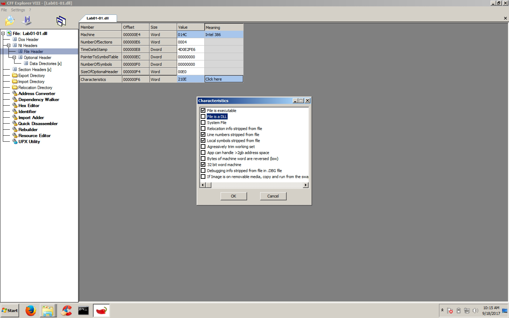
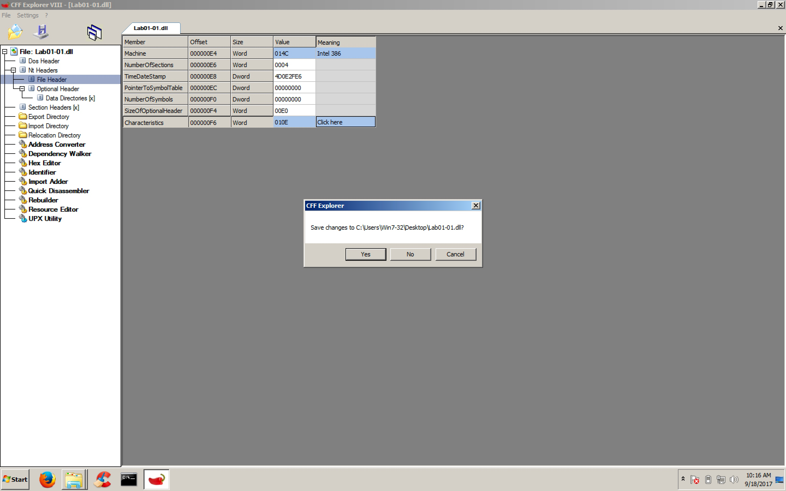
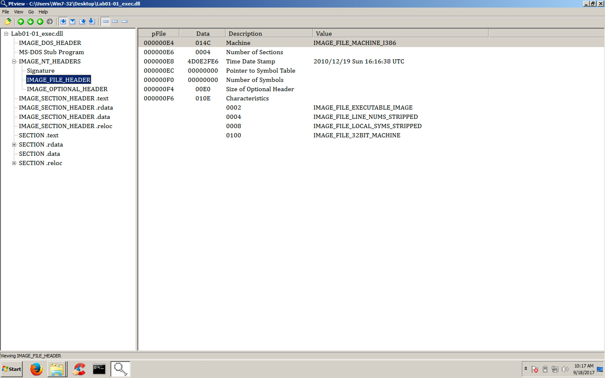
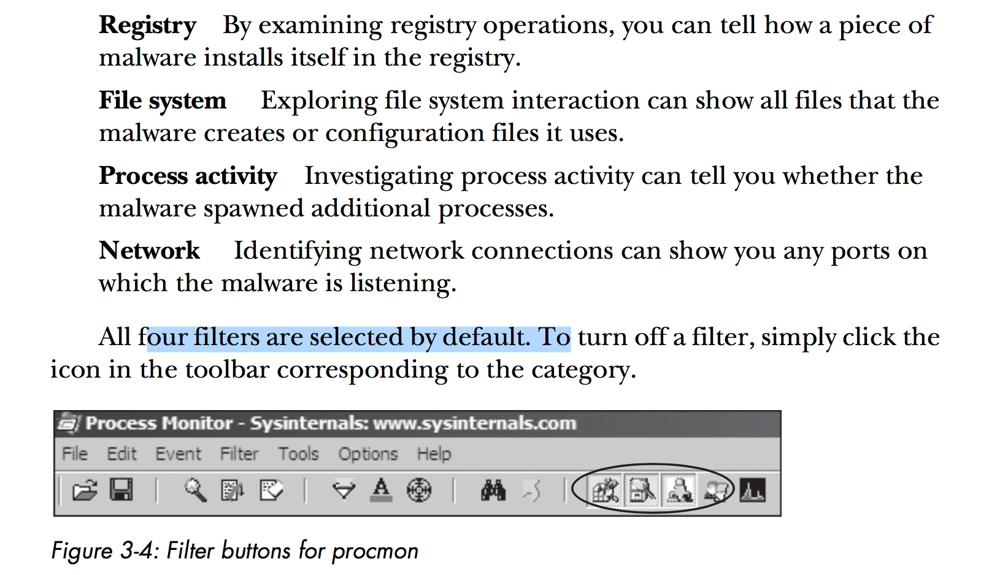
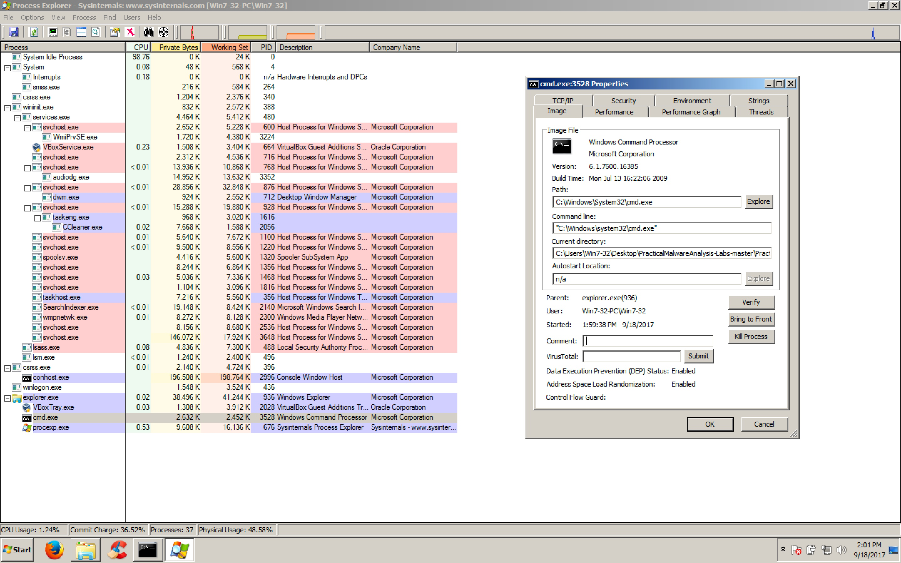
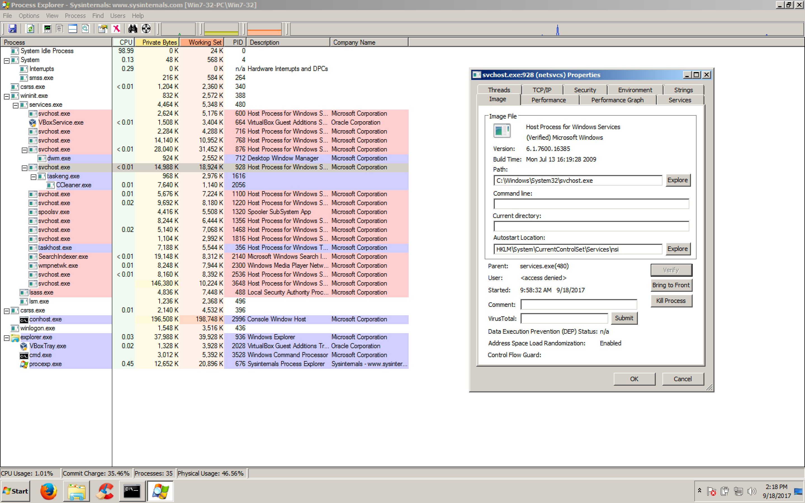
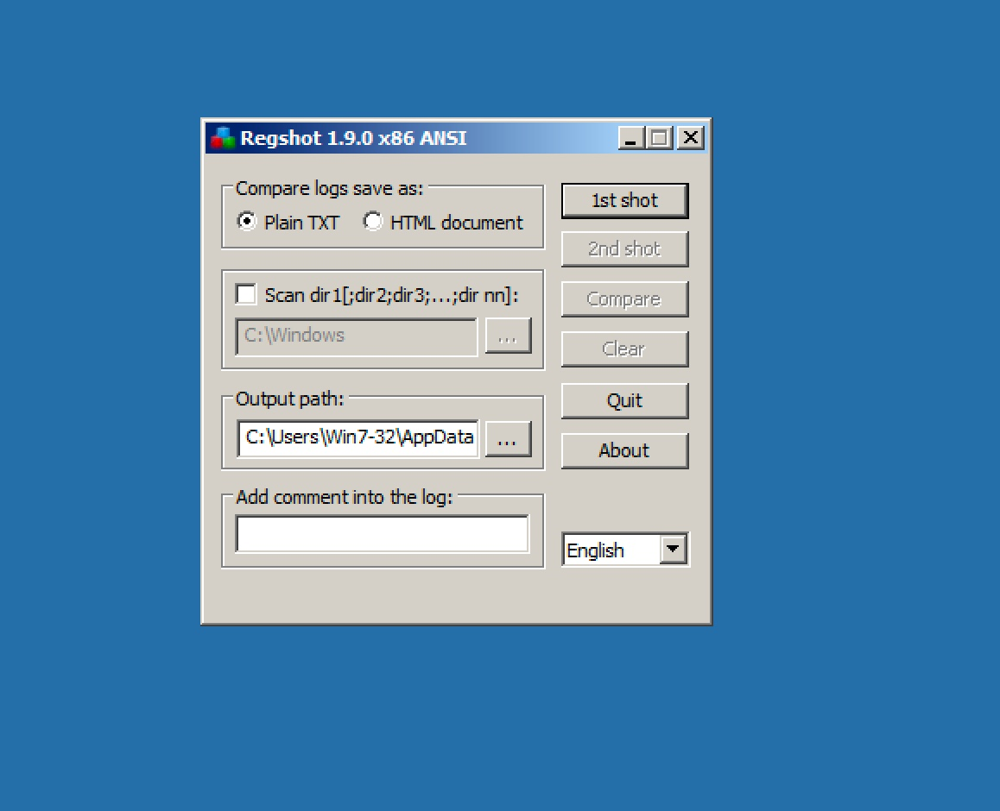
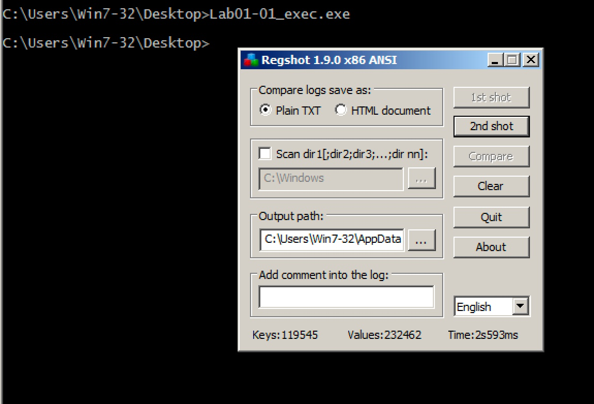
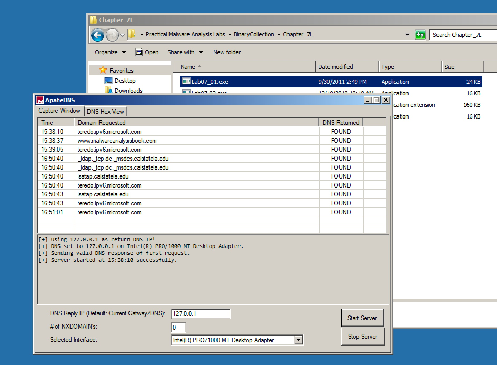

#### 3. Basic Dynamic Analysis

###### Sandboxes

- Norman SandBox
- GFI Sandbox
- Anubis
- Joe Sandbox
- ThreatExpert
- BitBlaze
- Comodo Instant Malware Analysis

Usual analysis leads to 

- Analysis Summary
- File Activity
- Created Mutexes
- Registry Activity
- Network Activity
- VirusTotal Results

###### Running Malware

- Run DLL

```sh
C:\>rundll32.exe DLLname, Export arguments
```

View exports of a DLL - PEview, PE Explorer 

```sh
C:\>rundll32.exe rip.dll, Install
```

Where ```Install``` is one of the exports

```sh
C:\>rundll32.exe xyzzy.dll, #5
```

where ```5``` is the ordinal number that you want to call, prepended with the # character

- Convert a ```DLL``` into an ```EXE```

Remove the ```IMAGE_FILE_DLL``` (```0x2000```) flag from the Characteristics field in the ```IMAGE_FILE_HEADER```

This will cause the ```DLLMain``` method to run.









- Install DLL malware as a service

DLL malware may also need to be installed as a service

```sh
C:\>rundll32.exe ipr32x.dll,InstallService ServiceName 
C:\>net start ServiceName
```

Where ```InstallService``` is an export. The ```ServiceName``` argument must be provided to the malware so it can be installed and run. The ```net start``` command is used to start a service on a Windows system. 

**When you see a ```ServiceMain``` function without a convenient exported function such as ```Install``` or ```InstallService```, you may need to install the service manually. You can do this by using the Windows ``sc`` command or by modifying the registry for an unused service, and then using ```net start``` on that service. The service entries are located in the registry at ```HKLM\SYSTEM\CurrentControlSet\Services```.**

###### Monitoring with Process Monitor

- Does not capture

	- Device driver activity of a user-mode component talking to a rootkit via device I/O controls
	- GUI calls, such as ```SetWindowsHookEx```
	- Network activity
	
	

- Stop procmon from capturing events

	File &rarr; Capture Events

- Clear displays

	Edit &rarr; Clear Display
	
- Detailed View
	
	
	
- Filtering
	
	
	
	Filter &rarr; Filter - Important Filters - ```Process Name, Operation, and Detail```
	
- Enable boot logging
	
	
	


###### Viewing Processes with Process Explorer


	
	Type | Color
	-----|----------
	Services | Pink
	Processes | Blue
	New processes | Green
	Terminated processes | Red

- Verify Option

	
	
	The Verify button verifies the image on disk rather than in memory,
and it is useless if an attacker uses ``process replacement``, which involves running a process on the system and overwriting its memory space with a malicious executable.

- Comparing Strings

	Used to identify ``process replacement``
	
	
	
	If the strings in memory and image are drastically different then ``process replacement`` may have occurred
	
	
	
	You can also use Process Explorer to analyze malicious documents, such as PDFs and Word documents. A quick way to determine whether a document is malicious is to open Process Explorer and then open the suspected malicious document. If the document launches any processes, you should see them in Process Explorer, and be able to locate the malware on disk via the Image tab of the Properties window.
	
- Comparing Registry Snapshots with Regshot

	1st shot &rarr; 2nd shot &rarr; Compare
	
	
	
	
	
	
	
###### Faking a Network

- ApateDNS


		
You can catch additional domains used by a malware sample through the use of the nonexistent domain (``NXDOMAIN``) option at. Malware will often loop through the different domains it has stored if the first or second domains are not found. Using this NXDOMAIN option can trick malware into giving you additional domains it has in its configuration.
		
- Monitoring with Netcat

```sh
nc -lvp 80
nc -lvp 443
```
		
###### Packet Sniffing with Wireshark

[Wireshark](https://www.wireshark.org/)

###### Using INetSim

- Simulate common Internet services

```sh
$ echo "deb http://www.inetsim.org/debian/ binary/" > /etc/apt/sources.list.d/inetsim.list
$ wget -O - http://www.inetsim.org/inetsim-archive-signing-key.asc | apt-key add -
$ apt update
$ apt install inetsim
```

```sh
root@kali:~# inetsim
INetSim 1.2.5 (2014-05-24) by Matthias Eckert & Thomas Hungenberg
Main logfile '/usr/share/inetsim/log/main.log' does not exist. Trying to create it...
Main logfile '/usr/share/inetsim/log/main.log' successfully created.
Sub logfile '/usr/share/inetsim/log/service.log' does not exist. Trying to create it...
Sub logfile '/usr/share/inetsim/log/service.log' successfully created.
Debug logfile '/usr/share/inetsim/log/debug.log' does not exist. Trying to create it...
Debug logfile '/usr/share/inetsim/log/debug.log' successfully created.
Using log directory:      /usr/share/inetsim/log/
Using data directory:     /usr/share/inetsim/data/
Using report directory:   /usr/share/inetsim/report/
Using configuration file: /usr/share/inetsim/conf/inetsim.conf
Parsing configuration file.
Configuration file parsed successfully.
=== INetSim main process started (PID 1702) ===
Session ID:     1702
Listening on:   127.0.0.1
Real Date/Time: 2017-09-18 20:44:08
Fake Date/Time: 2017-09-18 20:44:08 (Delta: 0 seconds)
 Forking services...
  * dns_53_tcp_udp - started (PID 1704)
  * time_37_tcp - started (PID 1719)
  * daytime_13_tcp - started (PID 1721)
  * dummy_1_udp - started (PID 1732)
  * quotd_17_tcp - started (PID 1727)
  * daytime_13_udp - started (PID 1722)
  * discard_9_tcp - started (PID 1725)
  * time_37_udp - started (PID 1720)
  * discard_9_udp - started (PID 1726)
  * echo_7_tcp - started (PID 1723)
  * irc_6667_tcp - started (PID 1714)
  * chargen_19_tcp - started (PID 1729)
  * echo_7_udp - started (PID 1724)
  * dummy_1_tcp - started (PID 1731)
  * chargen_19_udp - started (PID 1730)
  * syslog_514_udp - started (PID 1718)
  * ident_113_tcp - started (PID 1717)
  * finger_79_tcp - started (PID 1716)
  * quotd_17_udp - started (PID 1728)
  * ntp_123_udp - started (PID 1715)
  * tftp_69_udp - started (PID 1713)
  * https_443_tcp - started (PID 1706)
  * ftps_990_tcp - started (PID 1712)
  * smtp_25_tcp - started (PID 1707)
  * http_80_tcp - started (PID 1705)
  * pop3s_995_tcp - started (PID 1710)
  * ftp_21_tcp - started (PID 1711)
  * smtps_465_tcp - started (PID 1708)
  * pop3_110_tcp - started (PID 1709)
 done.
Simulation running.
```

	