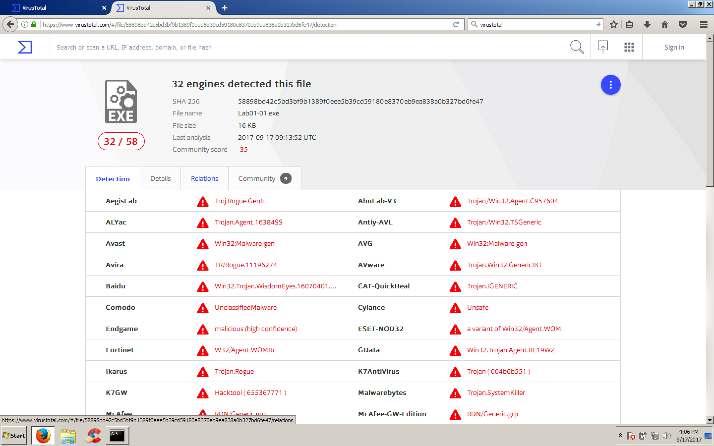
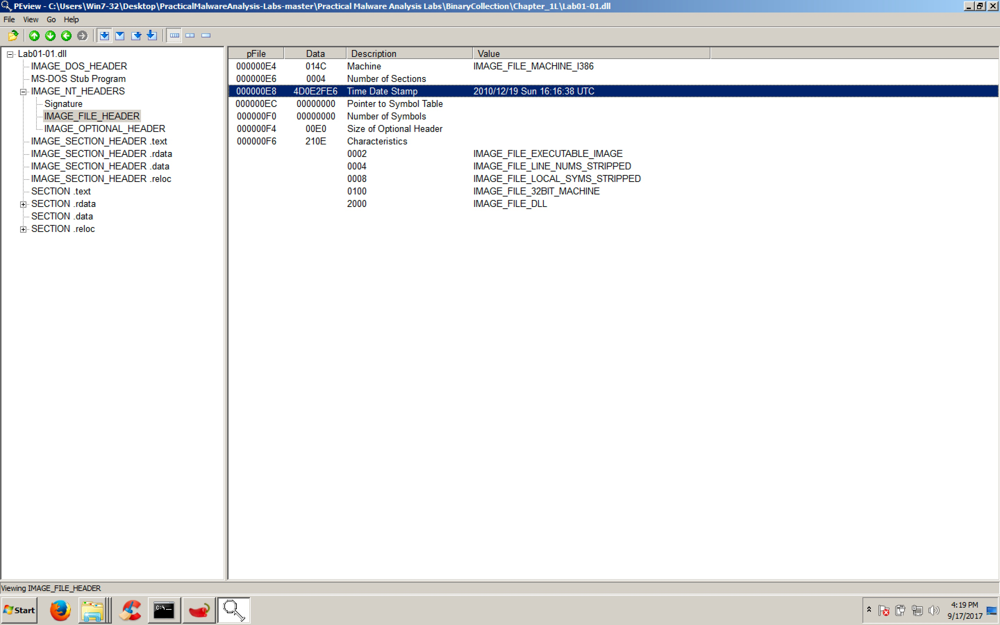
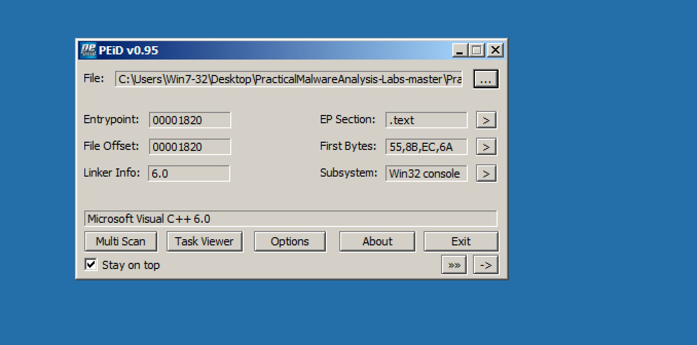
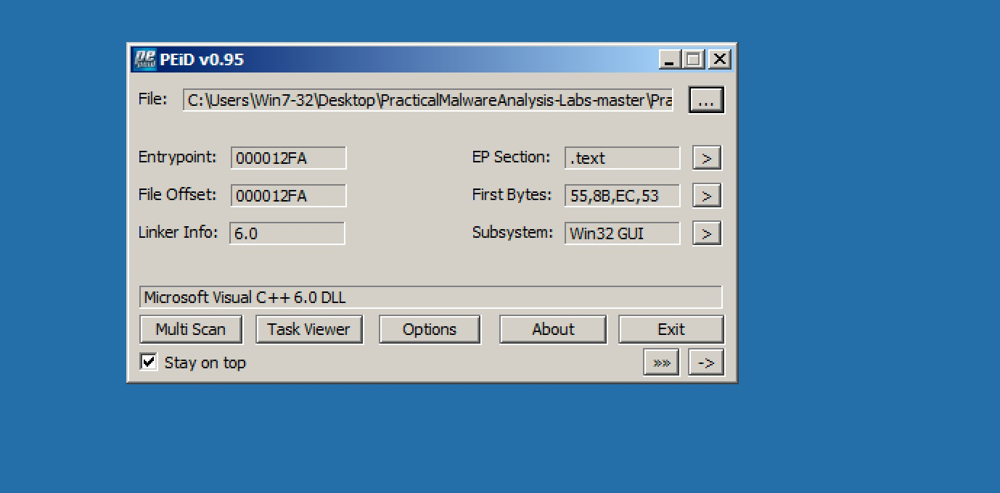
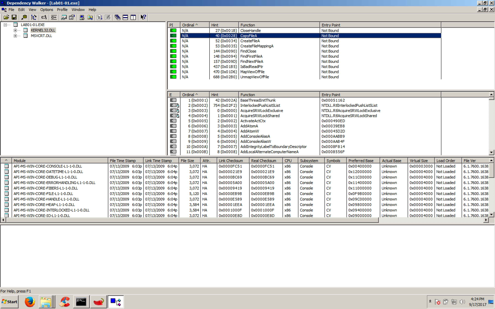
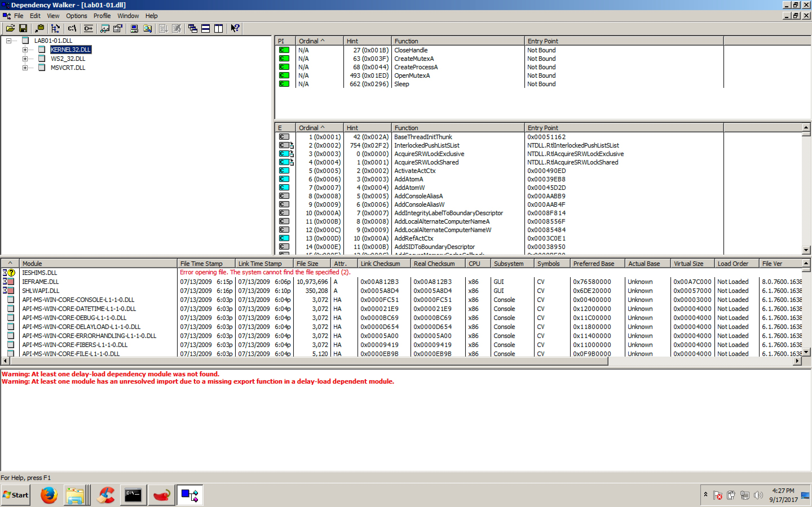

#### Lab 1-1

This lab uses the files ```Lab01-01.exe``` and ```Lab01-01.dll```. Use the tools and techniques described in the chapter to gain information about the files and answer the questions below.

1. Upload the files to ```http://www.VirusTotal.com/``` and view the reports. Does either file match any existing antivirus signatures?

	
	
	

2. When were these files compiled?

	Both files were compiled on December 19, 2010, within 1 minute of each other
	
	
	
	

3. Are there any indications that either of these files is packed or obfuscated? If so, what are these indicators?

	Not packed or obfuscated

	
	
	

4. Do any imports hint at what this malware does? If so, which imports are they?

	- Lab01-01.exe
		- FindFirstFile
		- FindNextFile
		- CopyFile
	
	These imports tell us that the program searches the filesystem
	and copies files.
	
	 
	
	- Lab01-01.dll
		- CreateProcess
		- Sleep. We also see that this file imports functions
		- ```WS2_32.dll```
			- network functionality
	
	
	
5. Are there any other files or host-based indicators that you could look for on infected systems?

	Examine ```C:\Windows\System32\kerne132.dll``` for additional malicious activity. Note that the file ```kerne132.dll```, with the number ```1``` instead of the letter ```l```, is meant to look like the system file ```kernel32.dll```. This file can be used as a host indicator to search for the malware.
	
	```sh
	C:\Users\Win7-32\Desktop>strings Lab01-01.exe
	
	Strings v2.53 - Search for ANSI and Unicode strings in binary images.
	Copyright (C) 1999-2016 Mark Russinovich
	Sysinternals - www.sysinternals.com
	
	!This program cannot be run in DOS mode.
	Richm
	.text
	`.rdata
	@.data
	_^[
	UVWj
	@jjj
	D$0
	@jjj
	D$(
	VUQ
	|$
	VUR
	ugh 0@
	d @
	|$
	_^][
	SUVW
	  @
	@0@
	D$@
	<0@
	D$@
	|$@
	, @
	|$D
	80@
	AQR
	|$@
	|$@
	, @
	h00@
	|$L
	d @
	_^][
	SUVW
	D$\
	PPj
	@jjj
	D$d
	@jjj
	h|0@
	t$t
	D$Pj
	0 @
	@jj
	0 @
	@jj
	l$\u
	0 @
	~<V
	|$@
	GxP
	u<U
	\$8
	NxQ
	T$p
	RWP
	L$|
	S$QWR
	D$L
	D$d
	PWQ
	D$l
	FxRVP
	D$<
	\$
	t$H
	|$D
	D$$3
	L$\
	T$,
	D$(
	l$
	t$
	L$0
	L$4
	L$@
	T$X
	D$8R
	L$\
	t$<f
	D$@
	p0@
	t0@
	x0@
	T$\
	D$$
	T$\
	T$,
	L$(
	L$(
	L$\
	|$D
	t$H
	T$,
	L$L
	T$PR
	hL0@
	h|0@
	$ @
	0 @
	hD0@
	_^]3
	hp @
	 SVW
	X @
	T @
	P @
	L @
	H @
	@ @
	< @
	0 @
	4 @
	%8 @
	%D @
	%\ @
	%` @
	CloseHandle
	UnmapViewOfFile
	IsBadReadPtr
	MapViewOfFile
	CreateFileMappingA
	CreateFileA
	FindClose
	FindNextFileA
	FindFirstFileA
	CopyFileA
	KERNEL32.dll
	malloc
	exit
	MSVCRT.dll
	_exit
	_XcptFilter
	__p___initenv
	__getmainargs
	_initterm
	__setusermatherr
	_adjust_fdiv
	__p__commode
	__p__fmode
	__set_app_type
	_except_handler3
	_controlfp
	_stricmp
	kerne132.dll
	kernel32.dll
	.exe
	C:\*
	C:\windows\system32\kerne132.dll
	Kernel32.
	Lab01-01.dll
	C:\Windows\System32\Kernel32.dll
	WARNING_THIS_WILL_DESTROY_YOUR_MACHINE
	
	C:\Users\Win7-32\Desktop>
	```

6. What network-based indicators could be used to find this malware on infected machines?

	The ```.dll``` file contains a reference to local IP address ```127.26.152.13```. This address is an artifact of this program having been created for educational and not malicious purposes. If this was real malware, the IP address should be routable, and it would be a good network-based indicator for use in identifying this malware.
	
	```sh
	C:\Users\Win7-32\Desktop>strings Lab01-01.dll
	
	Strings v2.53 - Search for ANSI and Unicode strings in binary images.
	Copyright (C) 1999-2016 Mark Russinovich
	Sysinternals - www.sysinternals.com
	
	!This program cannot be run in DOS mode.
	Rich
	.text
	`.rdata
	@.data
	.reloc
	SUV
	h8`
	h8`
	L$xQh
	h(`
	RVf
	D$"
	-(
	IQh `
	|$4
	D$$
	L$4PQj
	D$\D
	_^]
	u?h
	%d`
	Y^j
	=X`
	WVS
	WVS
	NWVS
	u7WPS
	u&WVS
	WVS
	_^[]
	%
	CloseHandle
	Sleep
	CreateProcessA
	CreateMutexA
	OpenMutexA
	KERNEL32.dll
	WS2_32.dll
	strncmp
	MSVCRT.dll
	free
	_initterm
	malloc
	_adjust_fdiv
	exec
	sleep
	hello
	127.26.152.13
	SADFHUHF
	/0I0[0h0p0
	141G1[1l1
	1Y2a2g2r2
	3!3}3
	
	C:\Users\Win7-32\Desktop>
	```

7. What would you guess is the purpose of these files?

	The ```.dll``` file is probably a backdoor. 
	
	The ```.exe``` file is used to install or run the ```DLL```.