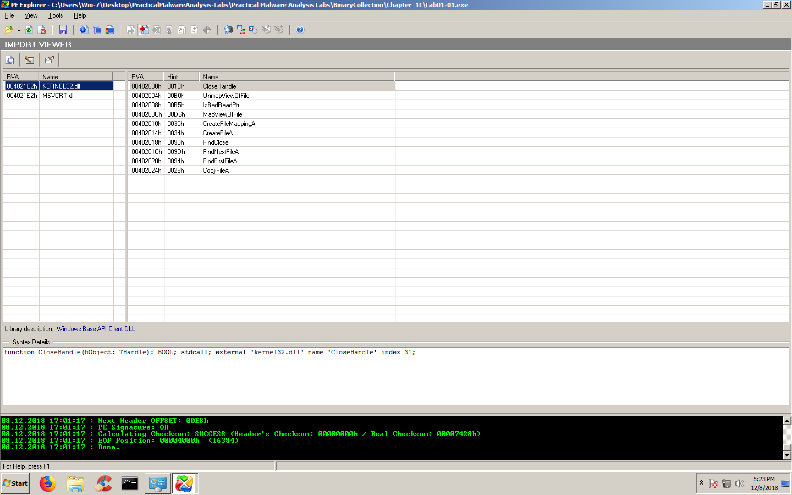
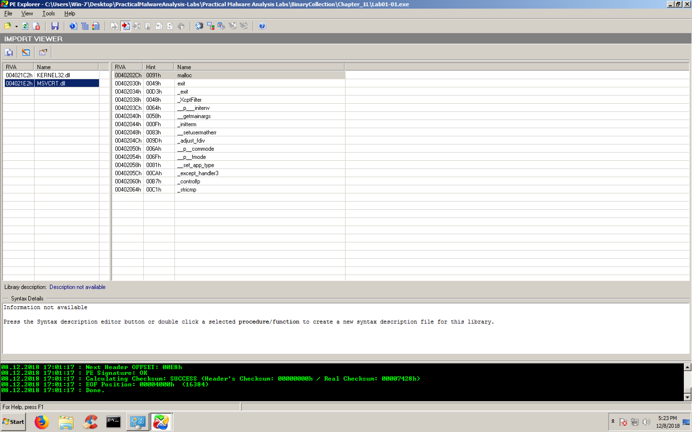

#### Lab 1-2

Analyze the file ```Lab01-02.exe```.

1. Upload the ```Lab01-02.exe``` file to ```http://www.VirusTotal.com/```. Does it match any existing antivirus definitions?

	

2. Are there any indications that this file is packed or obfuscated? If so, what are these indicators? If the file is packed, unpack it if possible.

	Packed with ```UPX```

	
	
	
	
	

3. Do any imports hint at this program’s functionality? If so, which imports are they and what do they tell you?

	- CreateService
	- InternetOpen
	- InternetOpenURL
	
	
	
	

4. What host or network-based indicators could be used to identify this malware on infected machines?

	- Host based signature
		- `kerne132.dll`
	- Service
		- ```Malservice```
	- Network Traffic
		- ```http://www.malwareanalysisbook.com```
	
	```sh
	C:\Users\Win7-32\Desktop>strings Lab01-02.exe
	
	Strings v2.53 - Search for ANSI and Unicode strings in binary images.
	Copyright (C) 1999-2016 Mark Russinovich
	Sysinternals - www.sysinternals.com
	
	!This program cannot be run in DOS mode.
	Rich
	.text
	`.rdata
	@.data
	@jj
	h(0@
	  @
	Vh(0@
	, @
	@jjjj
	L$,j
	@jjj
	@jjj
	T$
	$ @
	( @
	u+W
	=0 @
	jjj
	@jj
	VWj
	jjj
	hT0@
	t @
	=p @
	h00@
	 SVW
	` @
	\ @
	|0@
	X @
	x0@
	T @
	=l0@
	P @
	t0@
	5p0@
	H @
	D @
	@ @
	8 @
	%< @
	%L @
	%d @
	%h @
	KERNEL32.DLL
	ADVAPI32.dll
	MSVCRT.dll
	WININET.dll
	SystemTimeToFileTime
	GetModuleFileNameA
	CreateWaitableTimerA
	ExitProcess
	OpenMutexA
	SetWaitableTimer
	WaitForSingleObject
	CreateMutexA
	CreateThread
	CreateServiceA
	StartServiceCtrlDispatcherA
	OpenSCManagerA
	_exit
	_XcptFilter
	exit
	__p___initenv
	__getmainargs
	_initterm
	__setusermatherr
	_adjust_fdiv
	__p__commode
	__p__fmode
	__set_app_type
	_except_handler3
	_controlfp
	InternetOpenUrlA
	InternetOpenA
	MalService
	Malservice
	HGL345
	http://www.malwareanalysisbook.com
	Internet Explorer 8.0
	
	C:\Users\Win7-32\Desktop>
	```
	
###### Detailed

- To answer the first question, we upload the file to `VirusTotal.com`, which performs a scan against antivirus signatures. 
- Next, we open the files in `PEview`. For each file, we navigate to the `IMAGE_NT_HEADERS` &rarr; `IMAGE_FILE_HEADER` &rarr; `Time Date Stamp` field, which tells us the compile time. Both files were compiled on `December 19,2010`, within 1 minute of each other. This confirms our suspicions that these files are part of the same package. In fact, a compile time that close strongly suggests that these files were created at the same time by the same author. We know that the files are related because of the compile times and where they were found. It’s likely that the `.exe` will use or install the `.dll`, because DLLs cannot run on their own. Then we check to see if either file is packed. Both files have small but reasonable numbers of imports and well-formed sections with appropriate sizes.
- `PEiD` labels this as unpacked code compiled with `Microsoft Visual C++`, which tells us that these files are not packed. The fact that the files have few imports tells us that they are likely small programs. Notice that the DLL file has no exports, which is abnormal, but not indicative of the file being
packed. Next, we look at the files’ imports and strings beginning with the `.exe`. 
- All of the imports from `msvcrt.dll` are functions that are included in nearly every executable as part of the wrapper code added by the compiler. When we look at the imports from `kernel32.dll`, we see functions for opening and manipulating files, as well as the functions `FindFirstFile` and `FindNextFile`. These functions tell us that the malware searches through the filesystem, and that it can open and modify files. We can’t be sure what the program is searching for, but the .exe string suggests that it is searching for executables on the victim’s system.
- We also see the strings `C:\Windows\System32\Kernel32.dll` and `C:\windows\system32\kerne132.dll`. (Notice the change from the letter l to the number 1 in kernel32.dll.) The file `kerne132.dll` is clearly meant to disguise itself as the Windows `kernel32.dll` file. The file `kerne132.dll` can serve as a host-based indicator to locate infections, and it is one that we should analyze for malicious code. Next, we look at the imports and strings for `Lab01-01.dll`, which imports functions from `WS2_32.dll`. Because these functions are imported by ordinal, we don’t know which functions are being imported. We also see two interesting functions imported from `kernel32.dll`: `CreateProcess` and `Sleep`, which are commonly used as backdoors. These functions are particularly interesting to us in combination with the strings exec and sleep. The exec string is probably sent over the network to command the backdoor to run a program with `CreateProcess`. The sleep string is probably used to command the backdoor program to sleep.






