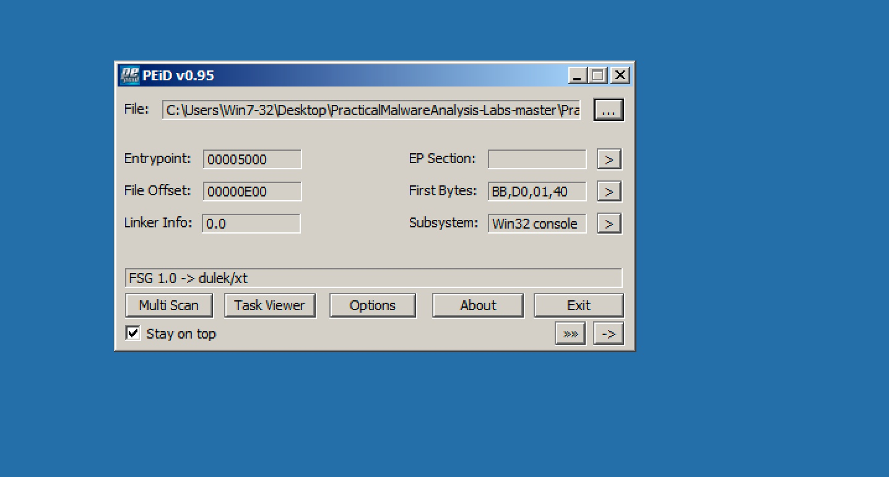
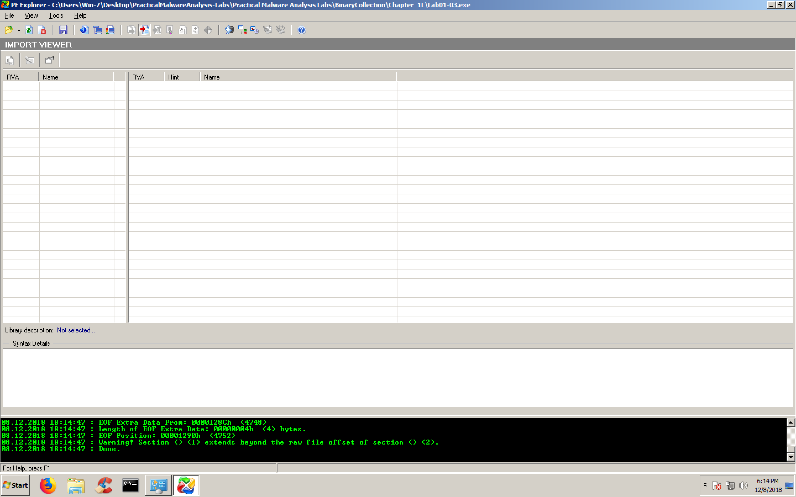
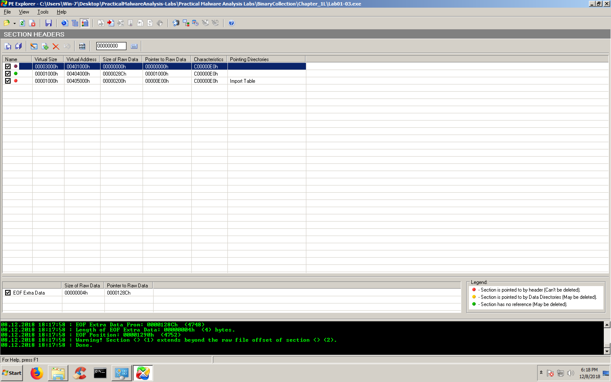

#### Lab 1-3

Analyze the file ```Lab01-03.exe```.

1. Upload the ```Lab01-03.exe``` file to ```http://www.VirusTotal.com/```. Does it match any existing antivirus definitions?

	

2. Are there any indications that this file is packed or obfuscated? If so, what are these indicators? If the file is packed, unpack it if possible.

	Packed with ```FSG```

	
	
	[Unpacking FSG](https://www.aldeid.com/wiki/Category:Digital-Forensics/Computer-Forensics/Anti-Reverse-Engineering/Packers/FSG#Unpacking_FSG_1.0)
	
	Packed programs only import ```LoadLibrary``` and ```GetProcAddress```
	
	

3. Do any imports hint at this program’s functionality? If so, which imports are they and what do they tell you?

	This question can’t be answered without unpacking the file

4. What host or network-based indicators could be used to identify this malware on infected machines?

	This question can’t be answered without unpacking the file
	
###### Detailed

- For the file Lab01-03.exe, `VirusTotal.com `reports a variety of different signatureswith vague-sounding names. The most common signature is that of a
file packed with the `FSG` packer. When we open the file in `PEview`, we see several indications that the file is packed. The first is that the file sections have no names. Next, we see that the first section has a virtual size of `0x3000`, but a raw data size of `0`. We run PEiD to confirm, and it identifies the packer as `FSG 1.0 -> dulek/xt`. To confirm that the file is packed, we search for the imports, but there doesn’t seem to be an import table. An executable file without an import table is extremely rare, and its absence tells us that we should try another tool, because PEview is having trouble processing this file. We open the file with Dependency Walker, and see that it does have an import table, but it imports only two functions: `LoadLibrary` and `GetProcAddress`. Packed files often import only these two functions, which further indicate that this file is packed. 



