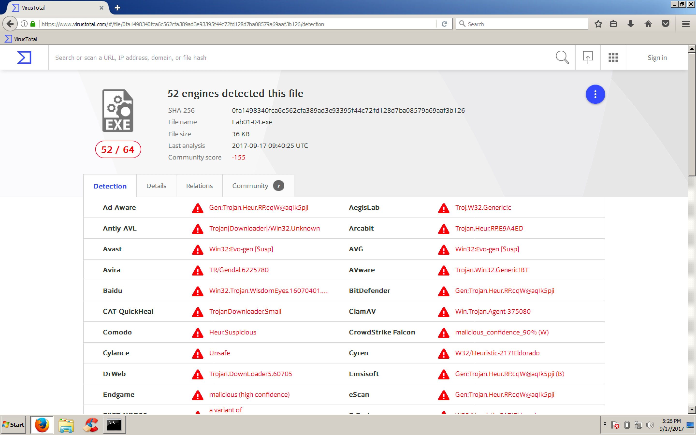
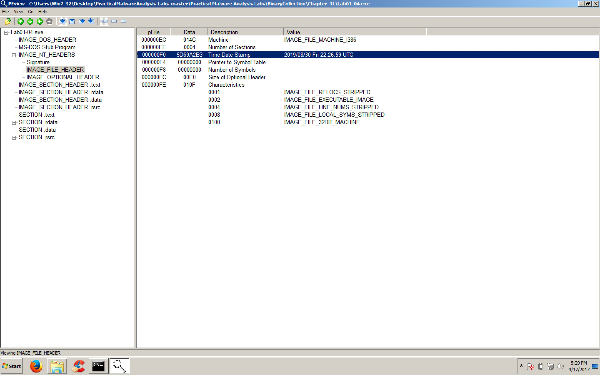
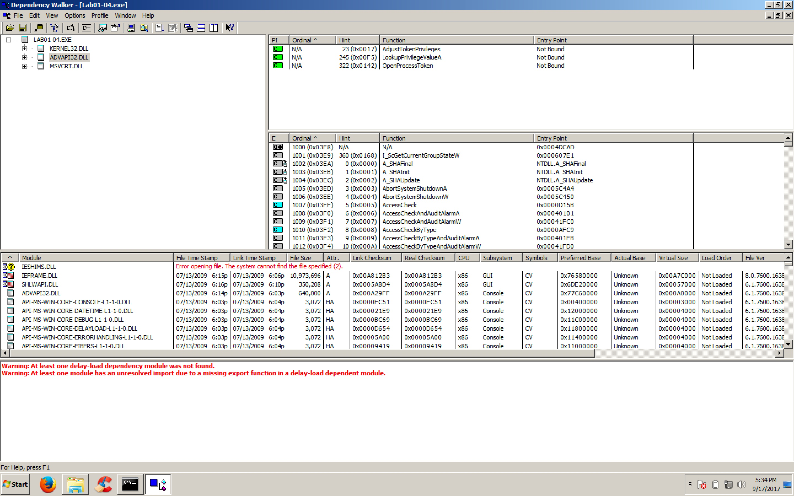

#### Lab 1-4

Analyze the file ```Lab01-04.exe```.

1. Upload the ```Lab01-04.exe``` file ```to http://www.VirusTotal.com/```. Does it match any existing antivirus definitions?

	

2. Are there any indications that this file is packed or obfuscated? If so, what are these indicators? If the file is packed, unpack it if possible.

	Not packed or obfuscated
	
	

3. When was this program compiled?

	This program was compiled in August 2019. Clearly, the compile time is faked, and we can’t determine when the file was compiled.
	
	

4. Do any imports hint at this program’s functionality? If so, which imports are they and what do they tell you?

	The imports from advapi32.dll indicate that the program is doing something with permissions. The imports from WinExec and WriteFile, along with the results from VirusTotal.com, tell us that the program writes a file to disk and then executes it. There are also imports for reading information from the resource section of the file.
	
	


5. What host or network-based indicators could be used to identify this malware on infected machines?

	The string \system32\wupdmgr.exe indicates that this program could create or modify a file at that location. The string www.malwareanalysisbook.com/ updater.exe probably indicates where additional malware is stored, ready for download.

	```sh
	C:\Users\Win7-32\Desktop>strings Lab01-04.exe
	
	Strings v2.53 - Search for ANSI and Unicode strings in binary images.
	Copyright (C) 1999-2016 Mark Russinovich
	Sysinternals - www.sysinternals.com
	
	!This program cannot be run in DOS mode.
	Rich
	.text
	`.rdata
	@.data
	.rsrc
	 0@
	$0@
	(0@
	*0@
	D @
	,1@
	(1@
	H @
	H @
	Pj(
	@ @
	H @
	jjj
	h,0@
	h@0@
	 1@
	D @
	jjj
	 1@
	( @
	4 @
	hL0@
	Qhd0@
	T @
	0 @
	hl0@
	hp0@
	, @
	L @
	$ @
	  @
	H @
	hx0@
	,1@
	(1@
	$1@
	=$1@
	=(1@
	=,1@
	$1@
	4 @
	T @
	< @
	T @
	8 @
	 SVW
	@1@
	D1@
	| @
	<1@
	x @
	81@
	t @
	H1@
	p @
	41@
	501@
	h @
	d @
	` @
	X @
	%\ @
	%l @
	CloseHandle
	OpenProcess
	GetCurrentProcess
	CreateRemoteThread
	GetProcAddress
	LoadLibraryA
	WinExec
	WriteFile
	CreateFileA
	SizeofResource
	LoadResource
	FindResourceA
	GetModuleHandleA
	GetWindowsDirectoryA
	MoveFileA
	GetTempPathA
	KERNEL32.dll
	AdjustTokenPrivileges
	LookupPrivilegeValueA
	OpenProcessToken
	ADVAPI32.dll
	_snprintf
	MSVCRT.dll
	_exit
	_XcptFilter
	exit
	__p___initenv
	__getmainargs
	_initterm
	__setusermatherr
	_adjust_fdiv
	__p__commode
	__p__fmode
	__set_app_type
	_except_handler3
	_controlfp
	_stricmp
	winlogon.exe
	<not real>
	SeDebugPrivilege
	sfc_os.dll
	\system32\wupdmgr.exe
	%s%s
	BIN
	#101
	EnumProcessModules
	psapi.dll
	GetModuleBaseNameA
	psapi.dll
	EnumProcesses
	psapi.dll
	\system32\wupdmgr.exe
	%s%s
	\winup.exe
	%s%s
	BIN
	!This program cannot be run in DOS mode.
	Rich
	.text
	`.rdata
	@.data
	h$0@
	Rh<0@
	QhD0@
	%L @
	hX @
	 SVW
	@ @
	< @
	8 @
	4 @
	=x0@
	0 @
	( @
	$ @
	  @
	%, @
	%D @
	GetWindowsDirectoryA
	WinExec
	GetTempPathA
	KERNEL32.dll
	URLDownloadToFileA
	urlmon.dll
	_snprintf
	MSVCRT.dll
	_exit
	_XcptFilter
	exit
	__p___initenv
	__getmainargs
	_initterm
	__setusermatherr
	_adjust_fdiv
	__p__commode
	__p__fmode
	__set_app_type
	_except_handler3
	_controlfp
	\winup.exe
	%s%s
	\system32\wupdmgrd.exe
	%s%s
	http://www.practicalmalwareanalysis.com/updater.exe
	
	C:\Users\Win7-32\Desktop>
	```

6. This file has one resource in the resource section. Use Resource Hacker to examine that resource, and then use it to extract the resource. What can you learn from the resource?

	The resource section contains another PE executable. Use Resource Hacker to save the resource as binary data, and then analyze the binary file as you would analyze any executable. The executable in the resource section is a downloader program that downloads additional malware.