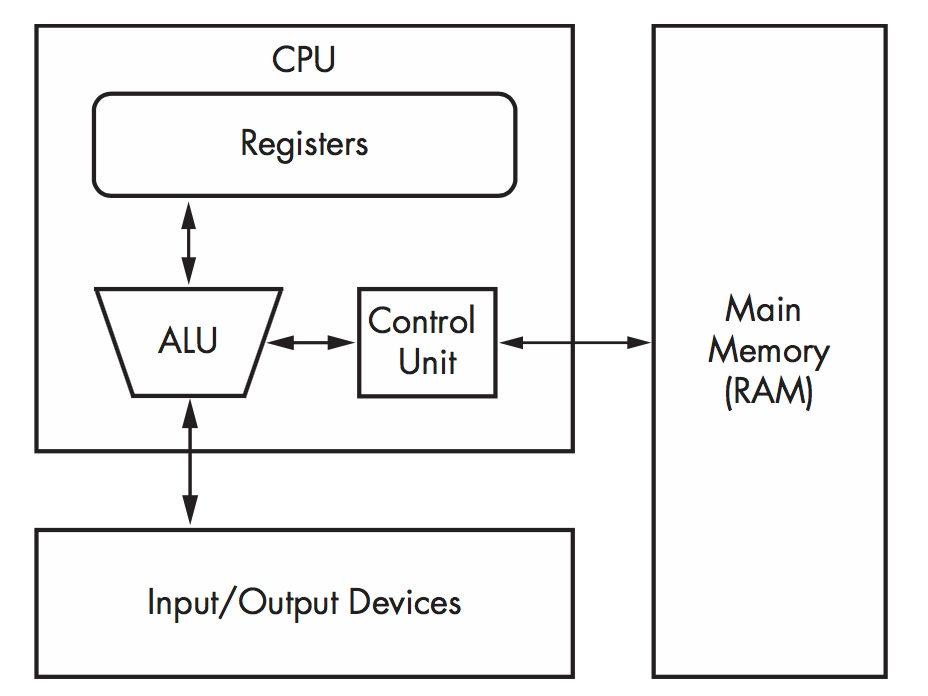

#### 4. A Crash Course in x86 Disassembly

###### Levels of Abstraction


###### The x86 Architecture

- Von Neumann architecture



- Main Memory


- Instructions


- Opcodes and Endianness


- Operands

	- Immediate operands - ```0x42```
	- Register - ```eax```
	- Memory address - ```[eax]```

- Registers

	- Multiplication and division instructions always use ``EAX`` and ``EDX``
	- Return value stored in ``EAX``


- Flags

Flag | Full Form | When is it set?
-----|-----------|---------------------------------
ZF | Zero Flag | result of an operation is equal to zero
CF | Carry Flag | result of an operation is too large or too small
SF | Sign Flag | result of an operation is negative or cleared when the result is positive
TF | Trap Flag | x86 processor will execute only one instruction at a time if this flag is set

- EIP

Contains the memory address of the next instruction to be executed

