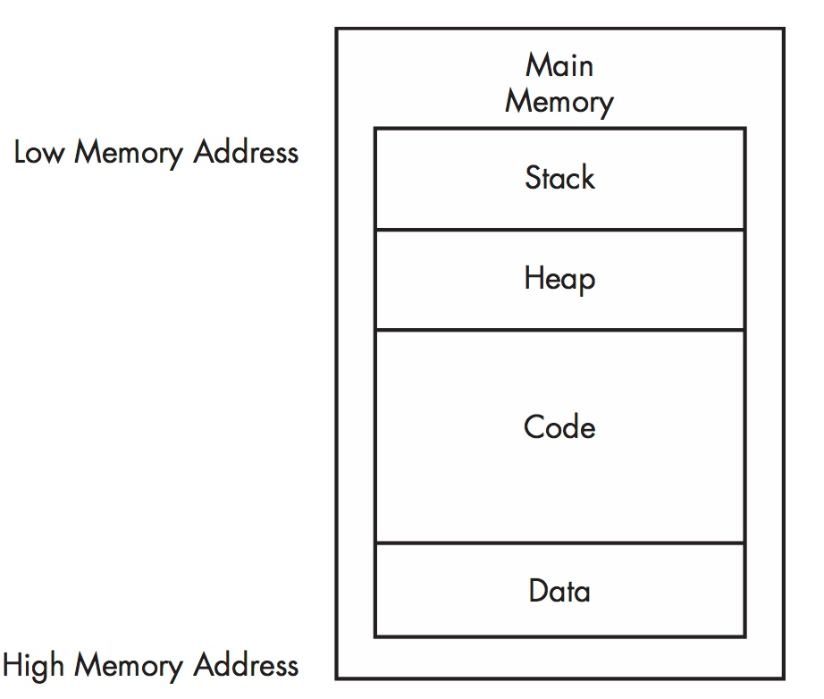
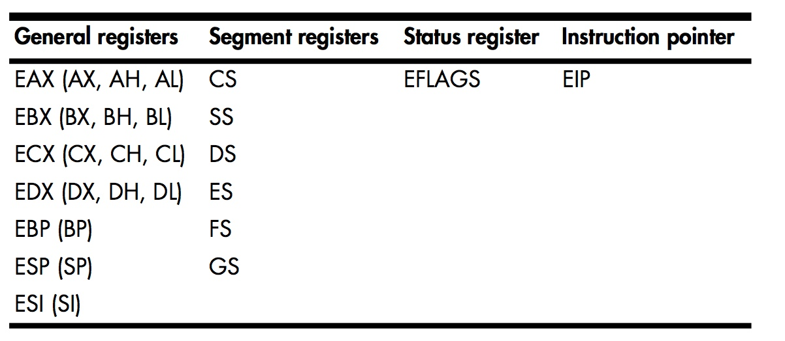
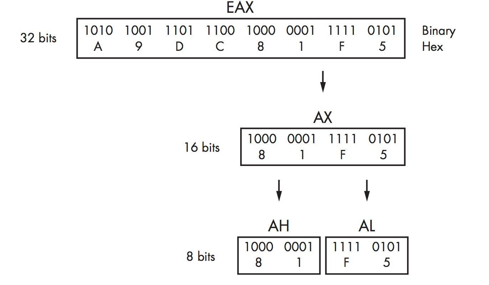
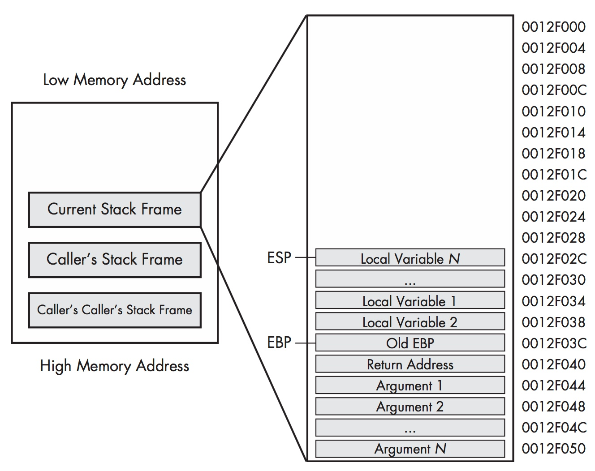
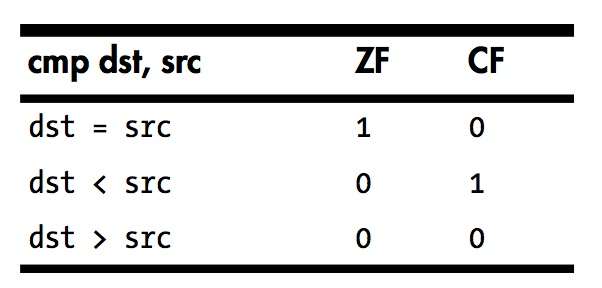
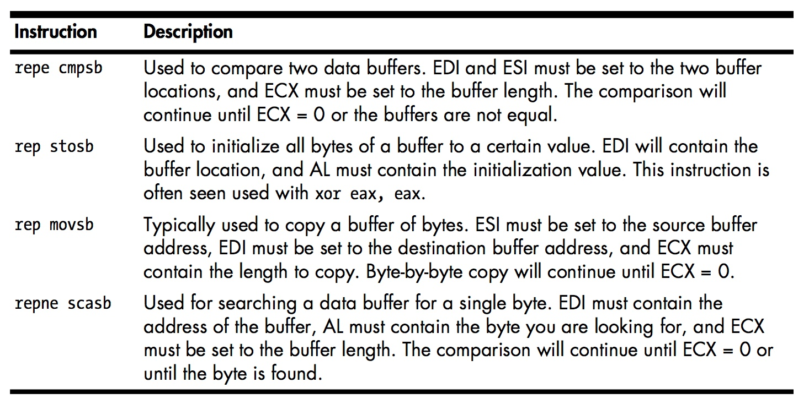

#### 4. A Crash Course in x86 Disassembly

###### Levels of Abstraction


###### The x86 Architecture

- Von Neumann architecture


- Main Memory



- Instructions


- Opcodes and Endianness


- Operands

	- Immediate operands - ```0x42```
	- Register - ```eax```
	- Memory address - ```[eax]```

- Registers

	- Multiplication and division instructions always use ``EAX`` and ``EDX``
	- Return value stored in ``EAX``





- Flags

Flag | Full Form | When is it set?
-----|-----------|---------------------------------
ZF | Zero Flag | result of an operation is equal to zero
CF | Carry Flag | result of an operation is too large or too small
SF | Sign Flag | result of an operation is negative or cleared when the result is positive
TF | Trap Flag | x86 processor will execute only one instruction at a time if this flag is set

- EIP

Contains the memory address of the next instruction to be executed

- Simple Instructions


```mov eax, [ebx+8]``` &rarr; ```eax = 0x20```

```lea eax, [ebx+8]``` &rarr; ```eax = 0xB30048```

- Arithmetic

	

	- mul

		```
		mul value
		```
		
		Multiplies ```EAX``` by value.
		
		Result is stored as a 64-bit value across two registers: ```EDX``` (most significant 32 bits) and ```EAX``` (least significant 32 bits)
		
	- div

		```
		div value
		```
		
		Does the same thing as ``mul``, except in the opposite direction
		
		Result of the division operation is stored in ``EAX``, and the remainder is stored in ``EDX``
		
		
		
	- shr and shl

		Values fall off
		
		```
		shr destination, count
		shl destination, count
		```
		
		The ``shr`` and ``shl`` instructions shift the bits in the destination operand to the right and left, respectively, by the number of bits specified in the count operand. Bits shifted beyond the destination boundary are first shifted into the ``CF`` flag. Zero bits are filled in during the shift. 
		
		Eg - binary value ``1000`` and shift it right by ``1``, the result is ``0100``
		
		``CF`` flag contains the last bit shifted out of the destination operand.
		
	- ror and rol

		Values get rotated to the other end 
		
		```
		ror destination, count
		rol destination, count
		```
		
		``ror`` and ``rol``, are similar to the shift instructions, except the shifted bits that “fall off” with the shift operation are rotated to the other end. In other words, during a right rotation (ror) the least significant bits are rotated to the most significant position. Left rotation (rol) is the exact opposite. 
		

		
- Optimization

Shifting &rarr; Optimization &rarr; Multiplication 

Normal | Optimized 
-------|-----------
shl eax, 1 | Multiply EAX by 2
shl eax, 2 | Multiply EAX by 4
shl eax, 3 | Multiply EAX by 8
 
```Shifting``` an operand to the ```left n bits``` multiplies it by ```2^n```.

Encryption or Compression function -  ```xor, or, and, shl, ror, shr, or rol```

- NOP

No Operation

```nop``` = ```xhcg eax, eax```

- The Stack

Stores local variables, parameters, and the return address

Function Prologue

```sh
push ebp
mov ebp, esp
sub esp, N
```

Optimized Function Prologue

```sh
enter N, 0
```

Function Epilogue

```sh
mov esp, ebp
pop ebp
ret
```

Optimized Function Epilogue

```sh
leave
ret
```



``pusha and pushad`` &rarr; push all the registers onto the stack

``popa and popad`` &rarr; pop all the registers off the stack

``pusha`` pushes the 16-bit registers on the stack in the following order &rarr; ``AX, CX, DX, BX, SP, BP, SI, DI``

``pushad`` pushes the 32-bit registers on the stack in the following order &rarr; ``EAX, ECX, EDX, EBX, ESP, EBP, ESI, EDI``

Compilers rarely use these instructions, so seeing them often indicates someone hand-coded assembly and/or shellcode.

- Conditionals

```test``` and ```cmp```

Instruction | Similar to | Flags of interest
------------|------------|---------------------
test | and | ZF
cmp | sub | ZF and CF



- Branching

Instruction | Description
------------|---------------
jz loc | Jump to specified location if ZF = 1. 
jnz loc | Jump to specified location if ZF = 0.
je loc | Same as jz, but commonly used after a cmp instruction. Jump will occur if the destination operand equals the source operand.
jne loc | Same as jnz, but commonly used after a cmp. Jump will occur if the destination operand is not equal to the source operand.
jg loc | Performs signed comparison jump after a cmp if the destination operand is greater than the source operand.
jge loc | Performs signed comparison jump after a cmp if the destination operand is greater than or equal to the source operand.
ja loc | Same as jg, but an unsigned comparison is performed.
jae loc | Same as jge, but an unsigned comparison is performed.
jl loc | Performs signed comparison jump after a cmp if the destination operand is less than the source operand.
jle loc | Performs signed comparison jump after a cmp if the destination operand is less than or equal to the source operand.
jb loc | Same as jl, but an unsigned comparison is performed.
jbe loc | Same as jle, but an unsigned comparison is performed.
jo loc | Jump if the previous instruction set the overflow flag (OF = 1).
js loc | Jump if the sign flag is set (SF = 1).
jecxz loc | Jump to location if ECX = 0.

- Rep Instructions

Rep instructions are a set of instructions for ``manipulating data buffers``.

``movsx, cmpsx, stosx, and scasx``

where ``x = b, w, or d for byte, word, or double word``

ESI &rarr; source index register

EDI &rarr; destination index register

ECX &rarr; counting variable


``rep movsb = C memcpy function``

``rep cmpsb = C memcmp function``

``rep stosb =  C function memset``


